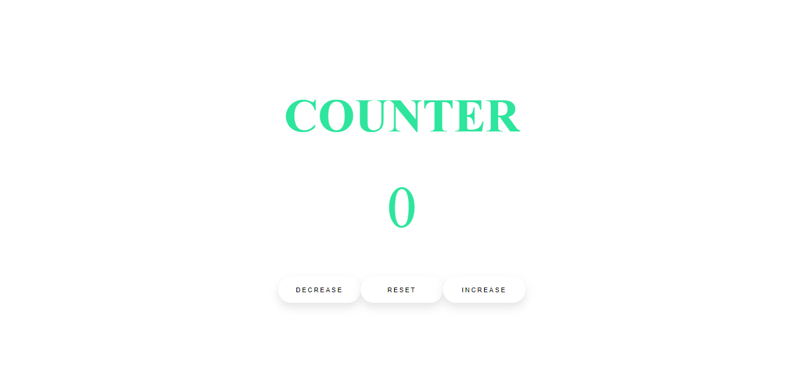

# Javascript Counter

> This JavaScript counter created in HTML5, CSS3 & JavaScript.

> The value counter will be zero (0) initially

 
 

# "INCREASE-BUTTON"

> When you click BUTTON "INCREASE" the value will be increasing like, 0, 1, 2, etc.

 
 

# "DECREASE-BUTTON"

> When you click BUTTON "DECREASE" the value will be Decreasing like, 0, -1, -2, etc.

 
 

# "RESET-BUTTON"

> When you click BUTTON "RESET" the value will be RESET to ZERO (0) if the value either increased or decreased

 
 

# "COUNTER-SCREEN"

